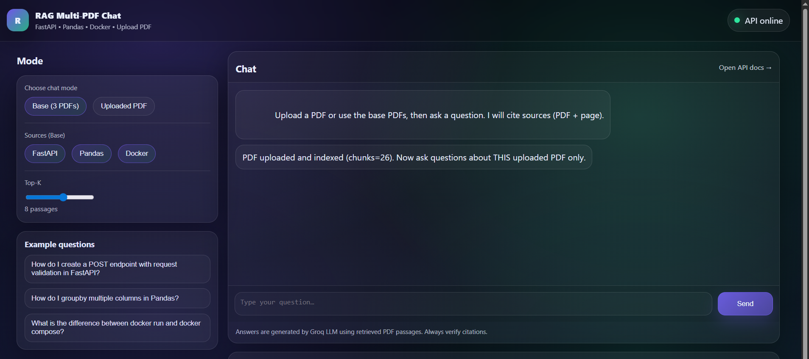
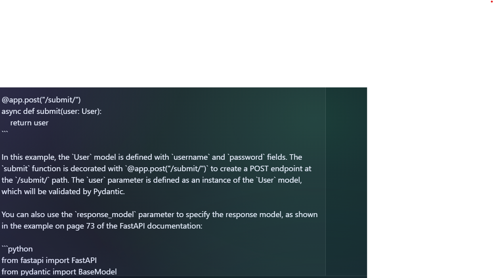
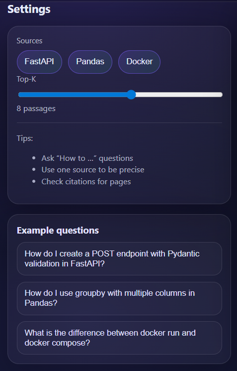

# RAG Multi‑PDF Chatbot (FastAPI + FAISS + OCR + Groq)

Un chatbot RAG (Retrieval‑Augmented Generation) qui répond aux questions à partir de **3 PDFs** (FastAPI, Pandas, Docker), avec :
- extraction texte + **OCR** (pour code en image),
- découpage en chunks,
- embeddings + **FAISS** (recherche sémantique),
- génération de réponse via **Groq API** (LLM),
- citations (PDF + page),
- interface web (HTML/CSS/JS) servie par **FastAPI**.

---

## Sommaire
- [Fonctionnalités](#fonctionnalités)
- [Architecture](#architecture)
- [Structure du projet](#structure-du-projet)
- [Prérequis](#prérequis)
- [Installation](#installation)
- [Configuration des clés API](#configuration-des-clés-api)
- [Pipeline (build index)](#pipeline-build-index)
- [Lancer l’application](#lancer-lapplication)
- [Utiliser l’API](#utiliser-lapi)
- [Interface Web](#interface-web)
- [Dépannage (Windows)](#dépannage-windows)
- [Améliorations possibles](#améliorations-possibles)
- [Licence & Notes](#licence--notes)

---

## Fonctionnalités
 Ingestion de PDFs (texte sélectionnable)  
 OCR des pages “image” (code capturé en image) avec Tesseract  
 Chunking + metadata (source/pdf/page)  
 Embeddings `sentence-transformers/all-MiniLM-L6-v2`  
 Index vectoriel FAISS (cosine similarity)  
 Endpoint FastAPI `/chat` qui:
- récupère les chunks pertinents,
- construit un prompt “grounded”,
- appelle un LLM via **Groq**,
- renvoie réponse + citations

 Page d’accueil “chat” design (frontend statique)

## Architecture

### Flux offline (préparation des données)
`PDFs` → `extract_ocr.py` → `pages.jsonl`  
`pages.jsonl` → `chunk.py` → `chunks.jsonl`  
`chunks.jsonl` → `build_index.py` → `index/faiss.index + index/meta.json`

### Flux online (chat)
Question utilisateur → embeddings → FAISS topK → prompt avec contexte → Groq LLM → réponse + citations

---

## Structure du projet 

rag-multi-pdf-chatbot/
├─ README.md
├─ requirements.txt
├─ .env                     
│
├─ data/
│  ├─ pdfs/
│  │  ├─ fastapi.pdf
│  │  ├─ pandas.pdf
│  │  └─ docker.pdf
│  └─ processed/
│     ├─ pages.jsonl
│     └─ chunks.jsonl
│
├─ index/
│  ├─ faiss.index
│  └─ meta.json
│
└─ src/
   ├─ extract_ocr.py
   ├─ chunk.py
   ├─ build_index.py
   ├─ api.py
   └─ web/
      ├─ static/
      │  ├─ style.css
      │  └─ app.js
      └─ templates/
         └─ index.html
## Interface

### Page d’accueil

### Chat + citations

### Settings

