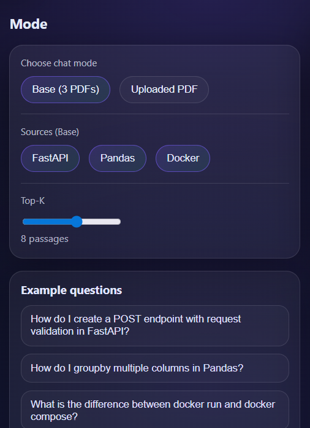

# RAG Multi‑PDF Chatbot (FastAPI + FAISS + OCR + Groq)

Un chatbot **RAG** (Retrieval‑Augmented Generation) qui répond aux questions à partir de :
- **Base (3 PDFs)** : FastAPI, Pandas, Docker (indexés en local)
- **Mode Upload** : l’utilisateur peut uploader **son propre PDF** et poser des questions dessus

Fonctionne avec :
- extraction texte + **OCR** (pour les 3 PDFs de base),
- embeddings + **FAISS**,
- génération via **Groq API** (LLM),
- **citations** (PDF + page),
- interface web (HTML/CSS/JS) servie par **FastAPI**.

---

## Sommaire
- [Fonctionnalités](#fonctionnalités)
- [Architecture](#architecture)
- [Structure du projet](#structure-du-projet)
- [Prérequis](#prérequis)
- [Installation](#installation)
- [Configuration des clés API](#configuration-des-clés-api)
- [Construire l’index (Base: 3 PDFs)](#construire-lindex-base-3-pdfs)
- [Lancer l’application](#lancer-lapplication)
- [Utiliser l’API](#utiliser-lapi)
- [Interface Web](#interface-web)
- [Dépannage (Windows)](#dépannage-windows)
- [Améliorations possibles](#améliorations-possibles)
- [Licence & Notes](#licence--notes)

---

## Fonctionnalités
### Mode Base (3 PDFs)
- Extraction du texte + **OCR** (Tesseract) pour le code en image
- Chunking + metadata (source/pdf/page)
- Embeddings : `sentence-transformers/all-MiniLM-L6-v2`
- Index vectoriel : **FAISS** (cosine similarity)
- Endpoint `/chat` :
  - retrieval top‑K passages
  - prompt “grounded”
  - appel Groq LLM
  - réponse + citations (PDF + page)

### Mode Upload (PDF utilisateur)
- Endpoint `/upload` :
  - upload PDF
  - création d’un index FAISS **par document**
  - retourne un `doc_id`
- Endpoint `/chat_doc` :
  - répond **uniquement** à partir du PDF uploadé (via `doc_id`)
- Remarque : le mode Upload est **text-only (sans OCR)** par défaut (les PDFs scannés peuvent échouer).

---

## Architecture

### Flux offline (Base: 3 PDFs)
`data/pdfs/*.pdf` → `extract_ocr.py` → `data/processed/pages.jsonl`  
`pages.jsonl` → `chunk.py` → `data/processed/chunks.jsonl`  
`chunks.jsonl` → `build_index.py` → `index/faiss.index + index/meta.json`

### Flux online (chat)
Question → embeddings → FAISS top‑K → prompt + contexte → Groq LLM → réponse + citations

### Flux online (upload)
Upload PDF → build index FAISS → `doc_id`  
Question + `doc_id` → retrieval → Groq LLM → réponse + citations

---


## Structure du projet
```text
rag-multi-pdf-chatbot/
├─ README.md
├─ requirements.txt
├─ .env.example
├─ .env                     
│
├─ assets/
│  └─ screenshots/
│     ├─ home.png
│     ├─ rep.png
│     └─ Mode.png
│
├─ data/
│  ├─ pdfs/                  
│  │  ├─ fastapi.pdf
│  │  ├─ pandas.pdf
│  │  └─ docker.pdf
│  └─ processed/         
│     ├─ pages.jsonl
│     └─ chunks.jsonl
│
├─ index/                    
│  ├─ faiss.index
│  └─ meta.json
│
├─ uploads/                
│
└─ src/
   ├─ extract_ocr.py
   ├─ chunk.py
   ├─ build_index.py
   ├─ api.py
   └─ web/
      ├─ static/
      │  ├─ style.css
      │  └─ app.js
      └─ templates/
         └─ index.html
```

## Page d’accueil


## Chat + citations


## Mode
